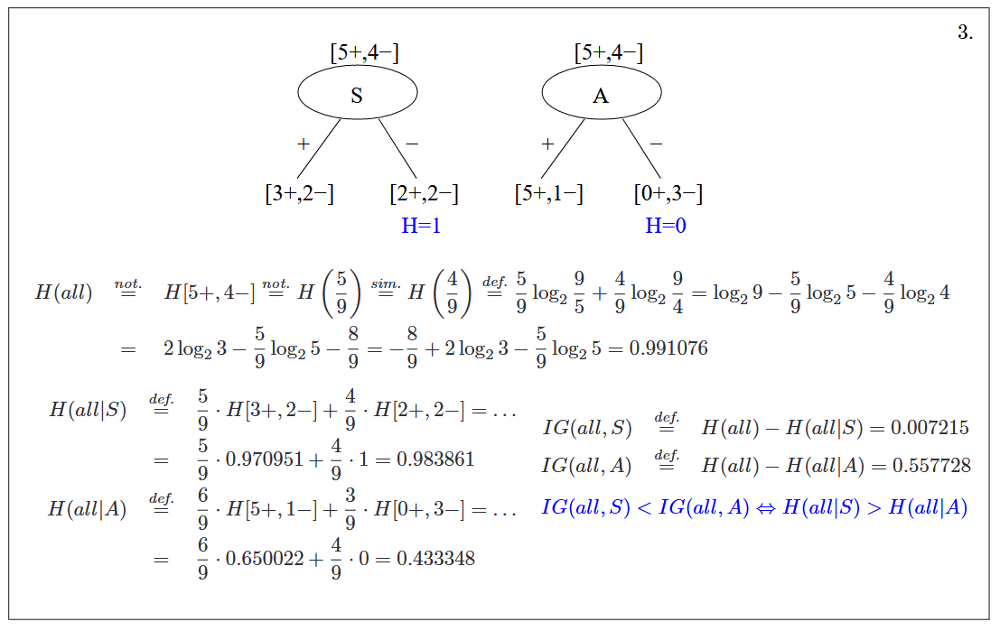

# Decision Stump(Compass) calculator

### Example:

Input:
```
2
2
[[3, 2], [2, 2]]
```

Output:
```
Entropy of root 0.9910760598382222
Entropy of leaf node partitions (2) [0.9709505944546687, 1]
Average conditional entropy of compass 0.9838614413637048
Information gain 0.007214618474517431
```



The functions and the used formulas can be found in [decisionCompass.ts](src/decisionCompass.ts)

### Running

You will need node and npm.
Type `npm install && npm run start` in this directory.
